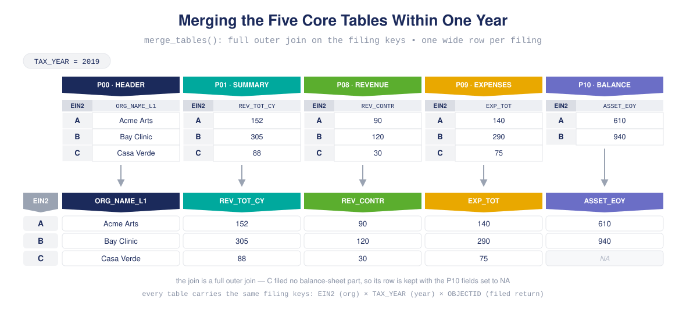
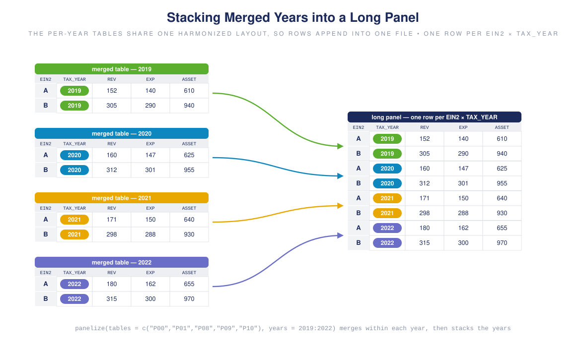

# panel990

<!-- badges: start -->
<!-- badges: end -->

**Retrieve, normalize, and assemble clean longitudinal panels from IRS 990 e-file data.**

`panel990` turns the hundreds of raw IRS 990 e-file tables into analysis-ready
organization-by-year panels. It downloads and merges the tables, harmonizes
their many blank-encoding conventions, classifies how each organization enters
and exits the panel, and fills or smooths gaps — all while keeping a running
ledger of everything it did.

It sits in the middle of the nonprofit open-data pipeline:

```
ef2  ──▶  panel990  ──▶  fiscal
(build      (assemble &      (fiscal-health
 tables)     normalize        metrics)
             panels)
```

## Installation

```r
# install.packages("remotes")
remotes::install_github("Nonprofit-Open-Data-Collective/panel990")
```

The DuckDB backend (for panels too large to hold in memory) is optional — install
it only if you need it:

```r
install.packages(c("DBI", "duckdb"))
```

## Overview

A 990 filing is spread across dozens of tables, each with its own grain, and the
same organization files every year. Building a panel from this means solving four
recurring problems, one per verb family:

| Problem | panel990 answer |
|---|---|
| Download, read, merge, and stack the right tables | `panelize()` — one call, automatic filing keys |
| Blanks that sometimes mean zero and sometimes mean "not applicable" | `panel_normalize()` — form-scoped, non-filer-safe |
| Organizations enter, leave, and skip years | `panel_describe()` / `panel_filter()` classification |
| Missing years and noisy series | `panel_impute()` / `panel_smooth()` / `panel_complete()` |

Every operation flows through a **panel object** that bundles the data with its
**sample frame** (the reusable specification of keys and rules) and a provenance
log you can print at any time with `manifest()`.

## Key features

- **One-call assembly** — `panelize()` runs download → read → merge → stack and
  assigns the filing keys (`EIN2` entity, `TAX_YEAR` time, `OBJECTID` record)
  automatically. Optional NCCS Business Master File join via `bmf = "auto"`.
- **The panel object** — data + sample frame + provenance travel together through
  a pipe of polymorphic `panel_*` verbs; extract with `as.data.frame()`.
- **Form-aware normalization** — `panel_normalize()` interprets blank core
  financials as zero only where the filed form actually asked the question
  (990 vs. 990EZ), and never fabricates zeros for non-filer rows.
- **Two-axis panel classification** — an organization's `panel_type` (boundary
  membership) and `panel_spell` (continuity) are classified independently.
- **Gap handling** — impute single-year gaps, smooth series with rolling windows,
  complete spans, and balance panels.
- **Accounting consistency** — `accounting_check()` and `reconcile()` test and
  minimally adjust rows against 58 bundled 990 accounting identities.
- **Scales past memory** — an optional DuckDB backend handles panels that don't
  fit in RAM, with identical results to the in-memory path.

## Panel classification vocabulary

`panel_type` and `panel_spell` are **orthogonal** — every organization gets one
label from each axis.

| `panel_type` (boundary) | Meaning |
|---|---|
| `persistent` | present in the **first and last** panel year |
| `entrant` | absent at the start, present at the end |
| `exit` | present at the start, absent at the end |
| `transient` | present only in the interior |

| `panel_spell` (continuity) | Meaning |
|---|---|
| `seamless` | every year between first and last is present |
| `segmented` | one or more interior years are missing |

## Reproducible example

The canonical workflow: assemble a four-year panel of the core financial tables,
inspect it, then clean it. Each cleaning step travels with the sample frame and
is recorded in the manifest. (`panelize()` downloads from the public NCCS e-file
store, so this example needs network access.)

```r
library(panel990)

# 1. Download -> read -> merge -> stack five core tables across four years.
#    Filing keys (EIN2 / TAX_YEAR / OBJECTID) are assigned automatically;
#    bmf = TRUE attaches NCCS Business Master File organization traits.
panel <- panelize(
  tables = c("P00", "P01", "P08", "P09", "P10"),
  years  = 2019:2022,
  bmf    = TRUE
)

# 2. See who enters, exits, persists, and where the gaps are.
panel_describe(panel)

# 3. Clean the panel. Every step is logged into the sample frame.
panel <- panel |>
  panel_deduplicate() |>                          # one filing per org-year
  panel_normalize()  |>                           # blank core financials -> 0
  panel_impute(max_gap_size = 1) |>               # fill single-year gaps
  panel_smooth(vars = "F9_08_REV_TOT_TOT", window = 3)

# 4. Pull the tidy data frame and the provenance ledger.
df <- as.data.frame(panel)
manifest(panel)          # every step: rows in/out, rules applied
```

### How `panelize()` assembles the panel

That one call in step 1 does three things. First, **within each year it merges
the five tables into one wide row per filing**. Each table holds one part of
the 990 form and carries the same filing keys — `EIN2` (organization),
`TAX_YEAR` (year), and `OBJECTID` (one id per filed return). The join is a
full outer join, so a filing missing from one part keeps its row (with `NA`s)
instead of being dropped.



Second, **the merged per-year tables are stacked into one long panel**. The
per-year frames share a harmonized column layout, so they append into a single
table with one row per organization-year:



Third, **`bmf = TRUE` appends organization traits from the NCCS Business
Master File**. The BMF holds one row per organization — time-invariant traits
like name, NTEE code, subsection, and geography — left-joined on `EIN2` and
broadcast to every year that organization appears. Filings without a BMF match
are kept, with the BMF columns set to `NA`.


Want the raw tables instead of a normalized panel? `download_tables()`,
`read_tables()`, and `merge_tables()` expose each stage of `panelize()`. Want a
reusable specification? `create_sfw()` builds a **sample frame** of keys and
typed rules that you can carry across projects and hand directly to `panelize()`.

## Learn more

The package ships task-focused vignettes:

- **Downloading tables** and the **sampling framework** — getting data in
- **Panels and slices** — the classification vocabulary
- **Imputing gaps**, **smoothing panels**, **completing spans**,
  **balancing panels** — cleaning
- **Accounting consistency** and **consistent gap-filling** — validation

```r
browseVignettes("panel990")
```

## Related packages

- [**ef2**](https://github.com/Nonprofit-Open-Data-Collective) — builds the
  upstream IRS 990 e-file tables that panel990 consumes.
- [**fiscal**](https://github.com/Nonprofit-Open-Data-Collective/fiscal) —
  computes nonprofit fiscal-health metrics on the panels panel990 produces.

---

Part of the [Nonprofit Open Data Collective](https://github.com/Nonprofit-Open-Data-Collective).
