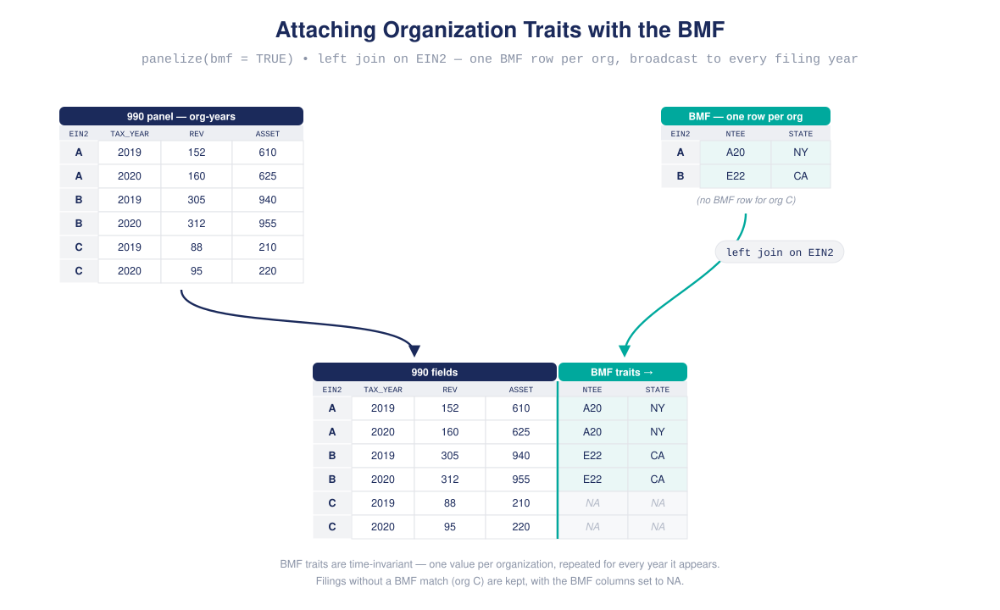

```{r, include = FALSE}
knitr::opts_chunk$set(collapse = TRUE, comment = "#>")
library(panel990)
```

`panel990` retrieves IRS 990 efile tables from the NCCS S3 bucket, merges the
tables that describe a filing, and stacks years into one panel. This tutorial
specifies everything with direct argument values -- no sample frame yet.

> The download chunks below are shown but **not executed** in this vignette;
> they require network access to the NCCS bucket. Run them in a live session.

## Table abbreviations

The efile data is split into ~125 tables, each corresponding to a section of the
990. `panel990` ships short aliases for the most common ones. Preview them with
`table_catalog()`; below, the catalog is joined with the bundled
`field_concordance` to add a readable name and the number of documented fields
per table:

```{r, eval = FALSE}
table_catalog()      # columns: table, alias, cardinality
```

```{r, echo = FALSE}
cat990 <- table_catalog()
cat990$alias[is.na(cat990$alias)] <- ""

# readable name from the table token
nice_name <- function(x) {
  nm <- tolower(gsub("[-_]+", " ", sub("^[A-Z0-9]+-(P[0-9]+-)?T[0-9]+-", "", x)))
  subs <- c("\\both\\b" = "other", "\\bfrgn\\b" = "foreign",
            "\\brltd\\b" = "related", "\\bbldg\\b" = "building",
            "\\bequip\\b" = "equipment", "\\bacts\\b" = "activities",
            "\\bindiv\\b" = "individuals", "\\bgovts\\b" = "governments",
            "\\bmisc\\b" = "miscellaneous", "\\bconserv\\b" = "conservation",
            "\\bhist\\b" = "historical", "\\bdir trust key\\b" =
              "directors, trustees, key employees",
            "\\birs\\b" = "IRS", "\\bus\\b" = "U.S.", "\\bez\\b" = "(EZ)",
            "\\bhce\\b" = "HCE", "\\bfap\\b" = "FAP")
  for (p in names(subs)) nm <- gsub(p, subs[[p]], nm)
  paste0(toupper(substring(nm, 1, 1)), substring(nm, 2))
}
# section label and concordance field counts
form <- ifelse(startsWith(cat990$table, "F9"), "Form 990",
               paste("Schedule", substring(cat990$table, 2, 2)))
part <- suppressWarnings(as.integer(sub("^..-P([0-9]+).*", "\\1", cat990$table)))
n_fields <- table(field_concordance$rdb_table)[cat990$table]
n_fields[is.na(n_fields)] <- 0

knitr::kable(
  data.frame(
    alias       = cat990$alias,
    table       = cat990$table,
    name        = nice_name(cat990$table),
    section     = ifelse(is.na(part) | part == 0, form,
                         paste0(form, ", Part ", part)),
    fields      = as.integer(n_fields),
    cardinality = cat990$cardinality
  ),
  row.names = FALSE
)
```

- **alias** -- the short token you pass to `tables=` (e.g. `"P08"`).
- **table** -- the canonical file name it resolves to.
- **fields** -- how many variables the bundled `field_concordance` documents
  for the table.
- **cardinality** -- `1x1` is one row per filing (safe to merge side-by-side);
  `1xm` is one-to-many (kept separate unless you opt in).

You are not limited to the aliases: any literal table name (for a schedule or a
newly published table) is accepted as-is. `resolve_tables()` shows how a request
resolves:

```{r}
resolve_tables(c("P00", "P08", "SB-P01-T00-CONTRIBUTORS"))
```

## The data source

`data_source()` configures where files come from. The default points at the
current NCCS release, so you rarely change it; pass a local directory to read
from disk.

```{r}
src <- data_source()
src$root
src$version
```

The efile release is versioned in the S3 prefix, and `version` is an argument
rather than a constant, so you can pin an analysis to a specific release or
reproduce earlier work:

```{r}
data_source(version = "v2_1")$root
```

Passing `root` explicitly (a local directory or a mirror) overrides `version`,
which is then recorded as `NA`.

## Downloading two tables for two years

`download_tables()` fetches (or reuses) the CSVs. Give it the years and tables
directly:

```{r, eval = FALSE}
dl <- download_tables(
  years  = 2019:2020,
  tables = c("P00", "P08"),     # header + revenue
  cache  = "retain",            # keep files in `path`; use "temporary" to discard
  path   = "PANEL990"
)
dl$manifest   # one row per table-year: status, bytes, path
```

Every table-year is recorded in a manifest, so you can see exactly what was
downloaded, reused, or failed.

Downloads print a `START` line before each transfer and an `OK`/`FAIL` line
when it settles, so a stalled file is identifiable while it is still running:

```
-> START    [1/4] F9-P00-T00-HEADER 2019
<- OK       [1/4] F9-P00-T00-HEADER 2019 337.0 MB in 41.3s @ 8.2 MB/s
```

Failed transfers are retried with exponential backoff, and partial files are
deleted between attempts so a truncated download is never mistaken for a valid
cache entry. Raise `retry_max` or `timeout` on an unreliable connection.

### Per-run logs

Each call writes its own log under `<path>/logs`, named for the run, so
repeated runs accumulate instead of overwriting one another:

```{r, eval = FALSE}
dl$run_id            # identifies this run
dl$log_file          # full manifest for this run
retrieval_log(path = "PANEL990")   # one row per run, oldest first
```

## Read, merge, and stack

Reading turns the CSVs into data frames; merging joins the tables *within* a
year on the filing keys; stacking binds the years together.

```{r, eval = FALSE}
rd <- read_tables(dl)                 # optionally columns=, filters=
mg <- merge_tables(rd)                # join P00 + P08 per year by filing keys
```

These stages report progress the same way downloads do, so a long `panelize()`
run is never silent -- reading, each per-year join, and the final stack each
announce themselves with dimensions and elapsed time:

```
-> READ     [1/4] F9-P00-T00-HEADER 2022 (338.0 MB)
<- READ OK  [1/4] F9-P00-T00-HEADER 2022 555,185 x 80 in 7.7s (54 duplicate row(s) removed)
-> MERGE    2022: F9-P00-T00-HEADER + F9-P10-T00-BALANCE-SHEET on EIN2, TAX_YEAR, ...
<- MERGE OK 2022 555,185 x 157 in 11.5s
-> STACK    2 year(s)
<- STACK OK 1,116,332 x 157 in 5.7s
```

Pass `verbose = FALSE` to any of them to silence it.

`merge_tables()` joins the `1x1` tables side-by-side (header fields next to
revenue fields, one row per filing) and reports each join in a manifest:

{width=100%}

The years are then stacked into a single data frame:

{width=100%}

### The one-shot form

`panelize()` runs download -> read -> merge -> stack in a single call and
returns a `panel` object. The filing keys (`EIN2` / `TAX_YEAR` / `OBJECTID`)
are assigned automatically:

```{r, eval = FALSE}
p <- panelize(tables = c("P00", "P08"), years = 2019:2020)
p
#> <panel>  ... rows x ... cols  years 2019-2020
#>   sample frame: panel[P00,P08 | 2019-2020]  (0 rules, ... log entries)
#>   panel labels: stale / not computed
df <- as.data.frame(p)
```

Two tables, two years: the package downloads four files, merges the two tables
in each year, and stacks 2019 on top of 2020.

## Adding BMF fields, then filtering by state

Geography, NTEE, and organization type are **not** on the 990 itself -- they
live in the Business Master File (BMF). To filter by state you first join the
BMF, then subset. `bmf_merge()` downloads and attaches the native BMF fields by
`EIN2`:

```{r, eval = FALSE}
df <- bmf_merge(df)                   # appends geo_state_abbr, subsection_code, ntee_*, ...
bmf_vars()                            # the fields it adds by default
```

### How the BMF is retrieved

The unified BMF is published as one parquet file (~640 MB) and one CSV
(~3.6 GB) holding identical rows. The default `format = "auto"` downloads the
**parquet** when DuckDB or arrow is installed, reading only the requested
columns; that transfers roughly a fifth of the bytes of the CSV.

With no parquet reader installed, retrieval falls back to the **per-state CSV
marts** (6--380 MB each) and stacks them. Stacking is a plain row bind, not a
join, so it is cheap, and each state is downloaded and retried independently --
which also makes it the robust choice on a flaky connection, and the efficient
way to work with one or two states:

```{r, eval = FALSE}
bmf <- bmf_retrieve(states = c("GA", "NC", "SC"))  # only these marts
bmf_states()                                       # all 63 published marts
```

The 63 marts cover the 50 states, DC, the territories, military and freely
associated postal codes, and `ZZ` for unresolved addresses.

**The state marts are a separate, lagging build, not a partition of the unified
file.** At the 2026_08 release they stack to 3,687,435 rows against the unified
file's 3,698,124 -- 0.29% fewer -- and their `bmf_vintage_ym` runs about a
month behind. Stacking all 63 therefore emits a warning. Use the parquet path
when the vintage matters; use the state marts for a state-scoped analysis or
when no parquet reader is available.

Transfers are verified against the published build manifest, which also records
the vintage of the data you retrieved:

```{r, eval = FALSE}
m <- bmf_manifest()
m$vintage                                    # e.g. "2026_08"
m$files[["bmf_unified_geocoded.parquet"]]$row_count
```

{width=100%}

Now the state column exists, so a plain base-R subset works:

```{r, eval = FALSE}
ga <- df[df$geo_state_abbr == "GA", ]
```

That is the whole manual pipeline: pick tables and years, download, merge,
stack, attach the BMF, and filter. The next tutorial shows how a **sample
frame** captures these same choices as a reusable, self-documenting object.
